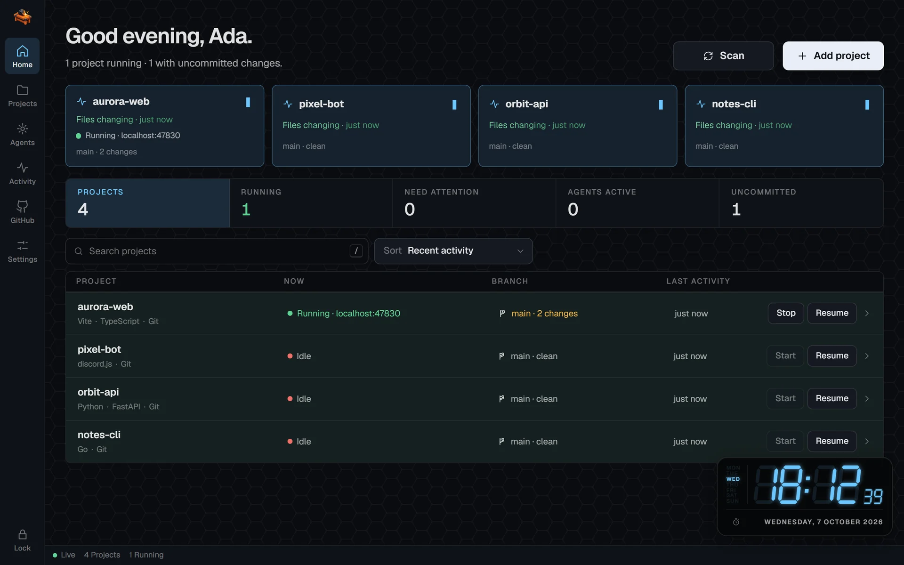
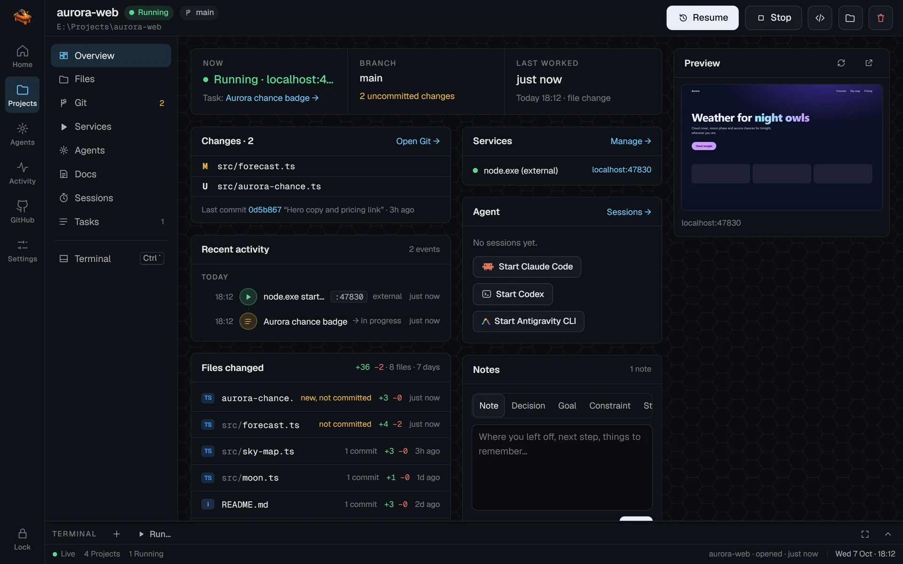
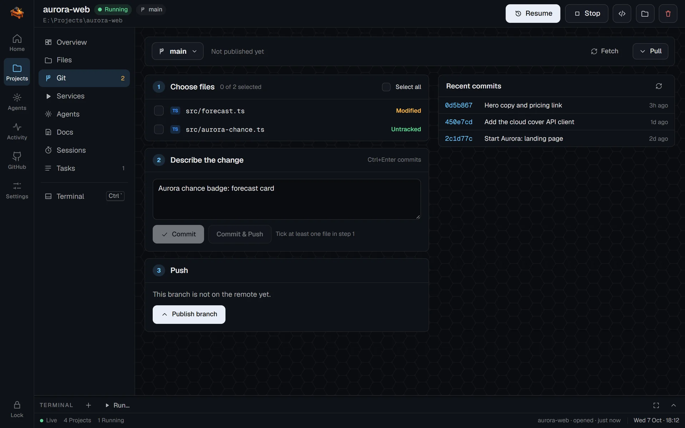
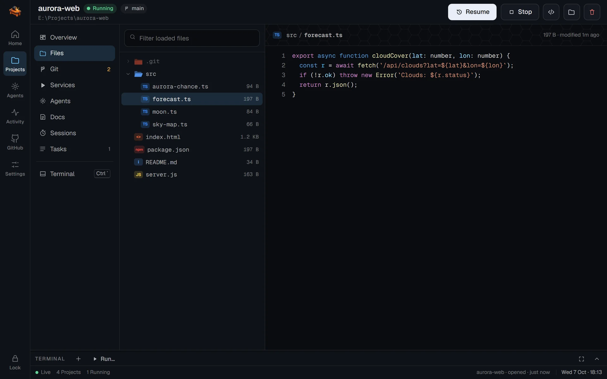
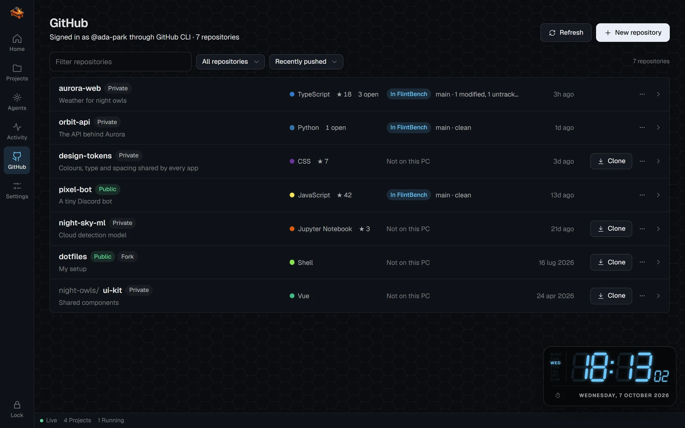
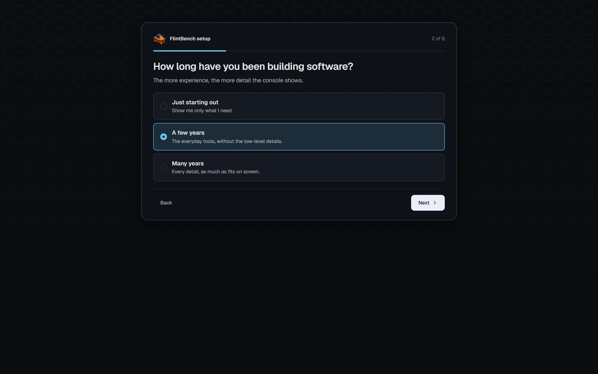
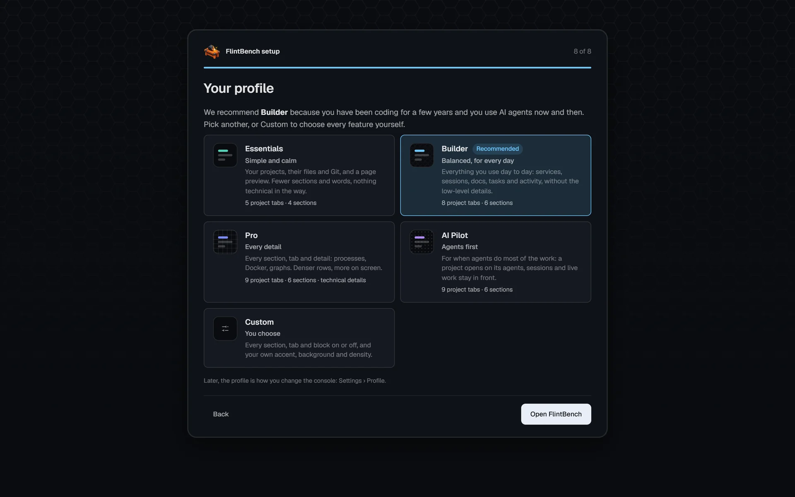
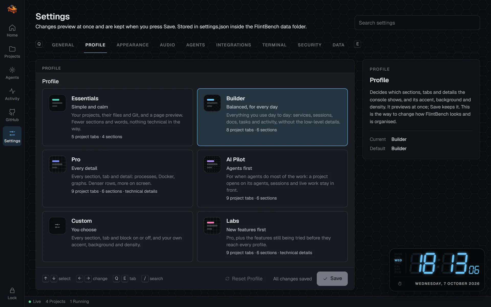
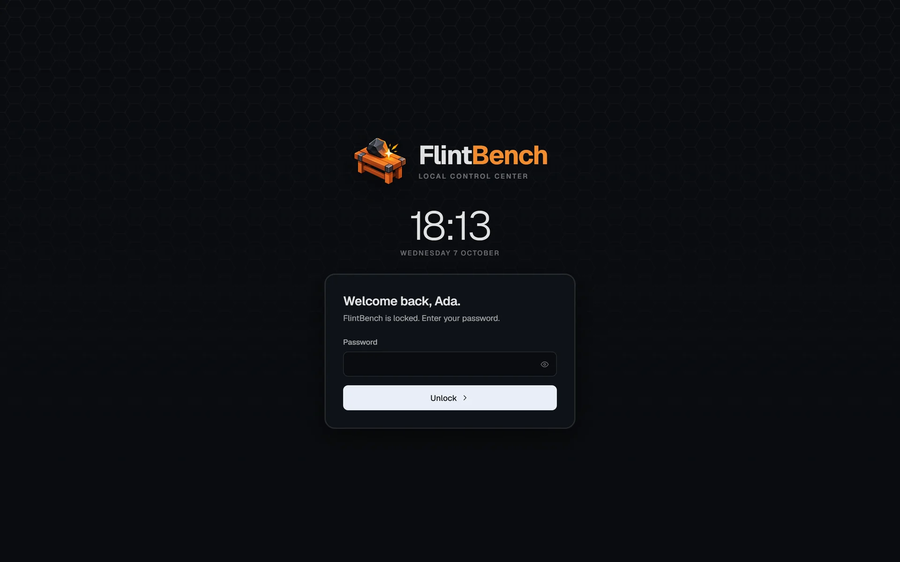

<div align="center">


# FlintBench

**Every project on your machine, in one place. Know where you left off and get back to work in seconds.**

A local control center for developers: your projects, their Git state, what is running, your editors,
your AI agents and your GitHub repositories, one click away. It runs on `localhost` and never phones home.




</div>

---

## Why FlintBench

You work on many projects, with many tools: a terminal here, VS Code there, an AI agent in another
window, a dev server you started an hour ago. FlintBench watches all of it **passively** and keeps
the state of every project in one place, so coming back to one takes seconds, not minutes.

> **Work however you want. FlintBench keeps track.**

- **Nothing to change in your habits.** Commit from your terminal, start `npm run dev` wherever you
  like, open the project in your editor: FlintBench notices.
- **Built from facts, never invented.** No productivity scores, no AI-written summaries: what you
  see is what happened in your folders, in Git and in your tools.
- **Works without Git and without agents.** Git makes it richer, agents are optional; the basics
  work for any folder.

## Highlights

| | |
| --- | --- |
| 🗂️ **Every project at a glance** | Live projects first, then each one with what is happening now, its branch and uncommitted changes, and when you last touched it. One click filters running, dirty or attention-needing projects. |
| ⏪ **Pick up where you left off** | Each project opens on a briefing: what changed, the last commit, the task in progress, your notes and decisions. |
| 🖥️ **Live page preview** | Web apps show a picture of the page they serve, even when you started the dev server yourself. When it stops, the preview says *Offline* over the last picture. |
| 🌿 **Git without leaving** | Pick files, describe, commit and push in three steps; branches, history and a diff for every file. Commits and pushes made elsewhere arrive as notifications. |
| 🐙 **Your GitHub, managed here** | Every repository of your account: clone, create, edit, archive, delete. A repository that is already a project opens its Git tab. |
| 🤖 **AI agents, when you use them** | Start, follow and resume Claude Code, Codex or Antigravity CLI in a project. They keep their own login: FlintBench stores no API key. |
| ▶️ **Services and terminals** | Start and stop dev servers, tests and Docker containers; a terminal dock per project. *Stop* also ends a dev server you started in your own terminal. |
| 🧭 **Shaped around you** | A short setup picks a profile (Essentials, Builder, Pro, AI Pilot or Custom) that decides which sections, tabs and details you see, and how the console looks. |

## A tour

<table>
  <tr>
    <td width="50%"></td>
    <td width="50%"></td>
  </tr>
  <tr>
    <td><b>Project overview</b><br>Now, branch and last work; changes, activity, files changed with lines added and removed, services, agent, notes and the live page preview.</td>
    <td><b>Git in three steps</b><br>Choose files, describe the change, push. Branches and recent commits on the side.</td>
  </tr>
  <tr>
    <td></td>
    <td></td>
  </tr>
  <tr>
    <td><b>Files</b><br>The project tree and any file, highlighted; open it in your editor from the right-click menu.</td>
    <td><b>GitHub</b><br>All your repositories, which ones are on this PC and their Git state; clone, create and manage them.</td>
  </tr>
  <tr>
    <td></td>
    <td></td>
  </tr>
  <tr>
    <td><b>A one-minute setup</b><br>A few questions on first launch: experience, AI agents, editors, GitHub, Docker, notifications and project folders.</td>
    <td><b>Your profile</b><br>The setup recommends one and explains why; pick another or build your own.</td>
  </tr>
  <tr>
    <td></td>
    <td></td>
  </tr>
  <tr>
    <td><b>Change profile any time</b><br>Settings › Profile previews a profile before you save it.</td>
    <td><b>Locked when you step away</b><br>A local account with password and optional PIN; FlintBench locks itself after a while.</td>
  </tr>
</table>

## Profiles

The profile is how you change what FlintBench shows and how it looks. Theme (dark, light, system)
and UI scale stay yours whatever the profile.

| | Essentials | Builder | Pro | AI Pilot | Custom |
| --- | :-: | :-: | :-: | :-: | :-: |
| **For** | just starting | every day | every detail | agents first | you decide |
| Sections: Agents, Activity | – | ✓ | ✓ | ✓ | your choice |
| Tabs: Agents, Docs, Sessions | – | ✓ | ✓ | ✓ | your choice |
| Tab: Graph | – | – | ✓ | ✓ | your choice |
| Files changed, agent block | – | ✓ | ✓ | ✓ | your choice |
| Technical details (Docker, processes) | – | – | ✓ | – | your choice |
| A project opens on | Overview | Overview | Overview | Agents | your choice |
| Density | comfortable | comfortable | compact | comfortable | your choice |

Answer *No* to "Do you build with AI agents?" and every agent button, tab and section disappears,
whatever the profile.

## Quick start

**Requirements**

- [Node.js](https://nodejs.org) **24.7 or newer** (FlintBench uses the built-in `crypto.argon2`)
- [Git](https://git-scm.com) on `PATH`
- Optional: [Docker](https://www.docker.com), an editor (VS Code, Cursor, Windsurf, Zed, Sublime Text,
  JetBrains IDEs…), the [GitHub CLI](https://cli.github.com), AI agents (Claude Code, Codex, Antigravity CLI)

**Run**

```bash
git clone https://github.com/veloranetwork8x/flintbench.git
cd flintbench
npm install
npm start            # then open http://localhost:4477
```

On first launch FlintBench asks you to create a local account (username, password, optional PIN),
then runs the setup and opens the console.

| Variable | Default | Purpose |
| --- | --- | --- |
| `FLINTBENCH_PORT` | `4477` | HTTP port |
| `FLINTBENCH_HOST` | `127.0.0.1` | Loopback only (`localhost`, `::1` also allowed) |
| `FLINTBENCH_DATA_DIR` | `./data` | Where FlintBench keeps its state |

`npm run dev` restarts the server when its code changes. `npm run reset-setup` brings back the
first run at the next start: the current account is kept aside, never deleted.

## Integrations

| Tool | What FlintBench does with it |
| --- | --- |
| **Editors** | Opens a project or a file in your default editor; the others you use are in the menus. VS Code, Cursor, Windsurf, Antigravity, VSCodium, Zed, Sublime Text, WebStorm, IntelliJ IDEA, PyCharm. |
| **Git** | Live status of every repository, whoever changes it; commit, push, pull, branches, diffs. |
| **GitHub CLI** | Lists and manages your repositories and publishes new ones. Sign in once with `gh auth login` (or from FlintBench): FlintBench never sees your token. |
| **Docker** | Compose services and containers per project, started and stopped with it. |
| **AI agents** | Claude Code, Codex and Antigravity CLI started in the project folder, followed and resumed; sessions started elsewhere are recognised. |

## Keyboard

| Keys | Action |
| --- | --- |
| `Ctrl/⌘ K` (or `Ctrl Shift P`) | Command palette: jump to a project, run a command |
| `Alt 1…6` | Home, Projects, Agents, Activity, Settings, GitHub |
| `/` | Search projects |
| `↑ ↓` / `j k`, `Enter` | Move and open on the dashboard |
| ``Ctrl ` `` | Show or hide the terminal dock |
| `Ctrl Enter` | Commit (in the commit box) |
| `Ctrl Shift L` | Lock |

## Privacy and security

- **Local only.** The server listens on loopback; requests from other hosts and origins are refused.
- **No account in the cloud, no telemetry, no database.** Everything lives in the data folder.
- **No API keys.** Agents and the GitHub CLI keep their own sign-in.
- **Your repositories are only read**, except for actions you trigger (Git, terminal, services, agents).
- **Passwords and PINs** are stored only as Argon2id hashes; browser sessions are hashed too.

Everything FlintBench owns is in `data/`:

```text
data/
├─ auth.json               argon2id hashes only
├─ settings.json
├─ projects.json
├─ ignored-projects.json
├─ projects/<id>/          notes, tasks, activity, sessions, file history, preview
└─ runtime/                instance lock, browser sessions (hashed)
```

Delete the `flintbench` folder (or only `data/`) to remove FlintBench and everything it stored.
Your projects are never stored there and never deleted.

## Good to know

- **Processes started outside FlintBench** are recognised by their command line or, for a server
  listening on a port, by the folder it runs in. A process that shows neither is not attributed.
- **External agent sessions** are detected from the agents' own session files (names, times and
  working folder only, never the conversation unless you turn on the live transcript).
- **Linux**: deep file changes are picked up by a periodic check instead of a recursive watcher.
- **The PIN** unlocks only a browser that already signed in with the password.
- Terminals and services started by FlintBench stop when FlintBench stops.

## Built with

Plain Node.js (HTTP, `fs.watch`, `crypto.argon2`) and vanilla JavaScript modules: no framework, no
build step. [ws](https://github.com/websockets/ws) for live updates,
[node-pty](https://github.com/microsoft/node-pty) and [xterm.js](https://xtermjs.org) for the
terminals, [Geist](https://vercel.com/font) and [Nerd Fonts](https://www.nerdfonts.com) symbols for type.

## License

[MIT](LICENSE). Bundled fonts keep their own licenses (see `app/web/fonts`).
